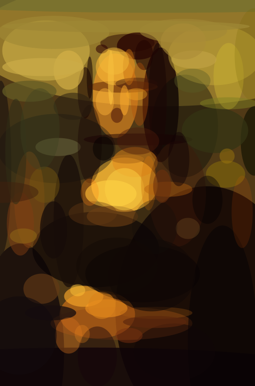

# Kaboom.
A tiny, fast static site photo gallery, with a linear narrative display scheme.  Written in node.js and Svelte.

[Design Goals](#design-goals)  
[Installation](#installation)
[Directory Structure](#directory-structure)
[CLI help](#cli-help)


<h3 id="design-goals">DESIGN GOALS</h3>

**Startup Bundle Size**  
The gallery focuses on quick load & first-paint.  Total bundle size is under 50kB (gzipped) -- with inline images included.

|                      |   raw     |    gzip   |    brotli   |
|----------------------|----------:|----------:|------------:|
|  index.html          |   3.8 kB  |   2.1 kB  |     1.3 kB  |
|  album-1-to-10.json  |  42.6 kB  |  15.1 kB  |    11.7 kB  |
|  album-basic.js      |  55.3 kB  |  19.8 kB  |    16.6 kB  |
|  bundle-basic.css    |   4.9 kB  |   1.7 kB  |     1.1 kB  |
|  **TOTAL**           |  **106.6 kB** |  **38.7 kB** |  **30.7 kB**  |

There are more files that load "below the fold", including the nav menu (JS and CSS), and images past the first 10 in an album.  But they load in a second wave and shouldn't affect startup speed.  

To some extent, your mileage will vary concerning the size of the `album-1-to-10.json` file.  It depends on how much text you include.  If you write a novel to accompany each image, the JSON is going to get bigger.

---

**Good Place Holders**  
The gallery makes good-looking inline placeholder images by using Michael Fogleman's amazing [Primitive](https://github.com/fogleman/primitive) library.  Images are rendered as simplified geometric mosaics, like this one. 



The place-holders are svg, made of 100 overlapping ovals.  The [Primitive](https://github.com/fogleman/primitive) library has many other options besides ovals, but I found that ovals look pretty good on a broad array of images, and they are VERY easy to compress.

---

**Narrative Focus**  
The gallery privileges description text.  It makes room for description, listing the text side-by side when the screen is wide enough.  


If you don't care about descriptions, this gallery might not be a good fit...?  But there are some layout settings to adjust this stuff.

---

<h3 id="installation">INSTALLATION</h3>

---

<h3 id="directory-structure">DIRECTORY STRUCTURE</h3>

Photo gallery libraries tend to get ambitious -- they want to be the place that a user organizes all of their photos.  For instance [Photoiew](https://photoview.github.io/) looks pretty cool for that purpose.  

The "Kaboom" library has a much smaller scope - to organize specific photos for web presentation, based on directories.  It does this with two directories, "gallery-static" and "gallery-active".  These directories are not included in the git repo, but you can generate and populate them with this command, run from the root of your "kaboom" project directory.

```cli
$~/kaboom> kaboom init
```

See the [CLI section](#cli-help) for more.

**The `gallery-static` Directory**  
The gallery expects to be flat -- a list of album directories at the top level, such that every album is a peer.  like this...

```
gallery-static
 -- first-album-url
 -- second-album-url
 -- third-album-url
```

**Album Structure**  
Each album has what I like to think is a reasonable, human-comprehensible structure.  The gallery expects a new album to look like this:

```
first-album-url
 -- __original
     -- image-1.jpg
     -- image-2.png
     -- image-3.jpeg
     -- image-4.gif
```

To include photos in a given album: you put the image files in the `__original` sub-directory.  

After the library processes all the images, your directory will look like this:

```
first-album-url
 -- __app
 -- __original
 -- large
 -- medium
 -- small
 -- svg
 -- tiny
 -- album-1-to-10.json
 -- album-11-plus.json
 -- index.html
```

The generated image files are fairly explicit and understandable.

```
first-album-url
 -- __app
 -- __original
     -- image-1.jpg
     -- image-2.png
     -- image-3.jpeg
     -- image-4.gif
 -- large
     -- image-1--large.jpg
     -- image-2--large.jpg
     -- image-3--large.jpg
     -- image-4--large.jpg
 ...
```

The order of the images on the page, and the descriptions for each image, are handled in the app, and stored in two JSON files:  `album-1-to-10.json` and 
`album-11-plus.json`

The json files -- with the notable exception of the "svgSequences" object -- are full of normal human-readable info.

```json
{
    "url":"demo-album",
    "section": "1-to-10",
    "imageCount": 4,
    "images":[
        {
            "fileName": "kaboom_1_demo.png",
            "width": 2400,
            "height": 1600,
            "title": "kaboom_1_demo.png",
            "description": "<h1>html description!</h1<p>What can I say?</p>",
            "svgHeight": "170",
            "svgWidth": "256"
        },
        {
            "fileName": "kaboom_2_demo.jpg",
            "width": 2400,
            "height": 1600,
            "title": "kaboom_2_demo.jpg",
            "description": "",
            "svgHeight": "170",
            "svgWidth": "256"
        },
        {
            "fileName": "kaboom_3_demo.jpeg",
            "width": 2400,
            "height": 1600,
            "title": "kaboom_3_demo.jpeg",
            "description": "",
            "svgHeight": "170",
            "svgWidth": "256"
        },
        {
            "fileName": "kaboom_4_demo.gif",
            "width": 2400,
            "height": 1600,
            "title": "kaboom_4_demo.gif",
            "description": "",
            "svgHeight": "170",
            "svgWidth": "256"
        }
    ],
    "svgSequences": {...}
}
```

---

<h3 id="cli-help">KABOOM CLI</h3>

Once you have run `npm install` and then `npm link`, the "kaboom" command should be available to the command line.  The command "kaboom" by itself will return a short help menu.

```cli
$> kaboom

------- KABOOM -----------                                                
                                                                          
 kaboom                   short help file                                 
 kaboom help              full help file                                  
                                                                          
 kaboom init              add /gallery-static, /gallery-active/demo-album 
 kaboom serve             web server on localhost:3300                    
                                                                          
 kaboom ingest            process images, all albums in /gallery-active   
 kaboom ingest [name]     process images in /gallery-active/[name]        
                                                                          
 kaboom to-static         move all /gallery-active to /gallery-static     
 kaboom to-static [name]  move /gallery-active/[name] to /gallery-static  
                                                                          
 kaboom to-active         move all /gallery-static to /gallery-active     
 kaboom to-active [name]  move /gallery-static/[name] to /gallery-active  
                                                                          
--------------------------                                                
                                                                          
```


